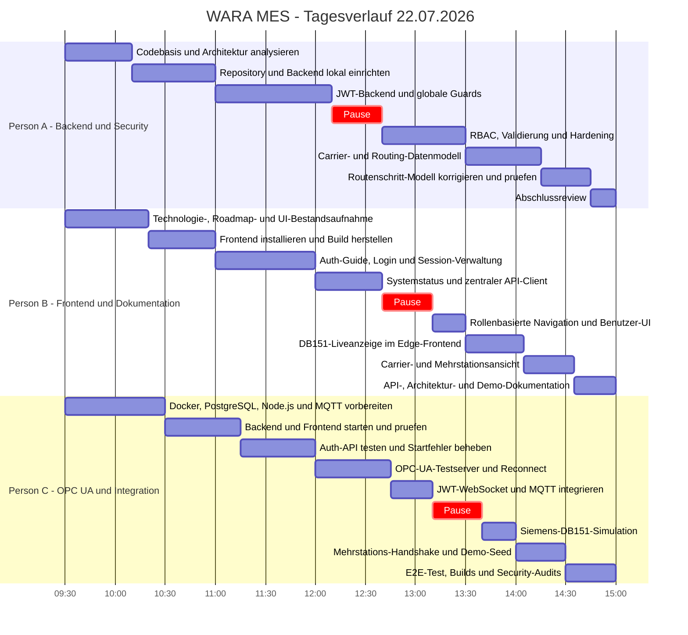

# Gantt-Diagramm - Arbeiten vom 22.07.2026

_Zeitraum: 09:30-15:00 Uhr | Team: 3 Personen | Retrospektive Aufteilung_

Die Zuordnung ist eine realistische nachtraegliche Teamaufteilung. Das Session-Log
enthaelt gemeinsame Meilensteinzeiten, aber keine personenbezogene Zeiterfassung.

## Aufwand

| Person | Schwerpunkt | Anwesenheit | Pause | Arbeitszeit |
|---|---|---:|---:|---:|
| Person A | Backend und Security | 5,5 h | 0,5 h | 5,0 h |
| Person B | Frontend und Dokumentation | 5,5 h | 0,5 h | 5,0 h |
| Person C | OPC UA und Integration | 5,5 h | 0,5 h | 5,0 h |
| **Gesamt** | | **16,5 Personenstunden** | **1,5 h** | **15,0 Personenstunden** |

## Ergebnisse

- Lokale Entwicklungsumgebung mit PostgreSQL, Backend und Frontend hergestellt.
- Phase 1 mit JWT, RBAC, Validierung, Rate Limiting und Security-Hardening abgeschlossen.
- Authentifizierte Live-Telemetrie ueber OPC UA, MQTT und WebSocket umgesetzt.
- Siemens-DB151-Demo sowie Zwei-Stationen-stMES-Handshake implementiert.
- Carrier-, Routing- und Handshake-Modell einschliesslich Demo-Seed erstellt.
- Frontend um Login, Benutzerverwaltung, Carrier und Mehrstations-Edge-Anzeige erweitert.
- Backend und Frontend gebaut, E2E-Demo geprueft und npm-Audits ohne bekannte Luecken abgeschlossen.
